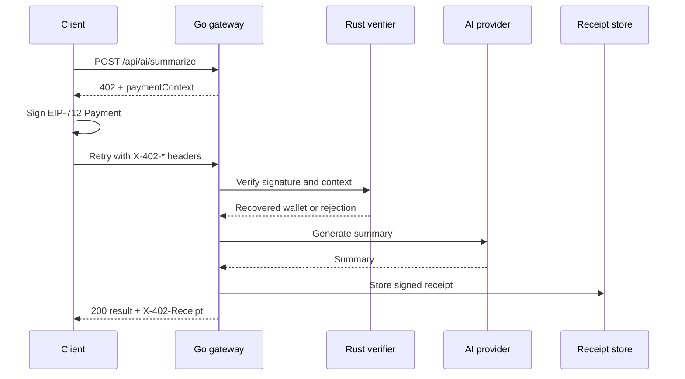
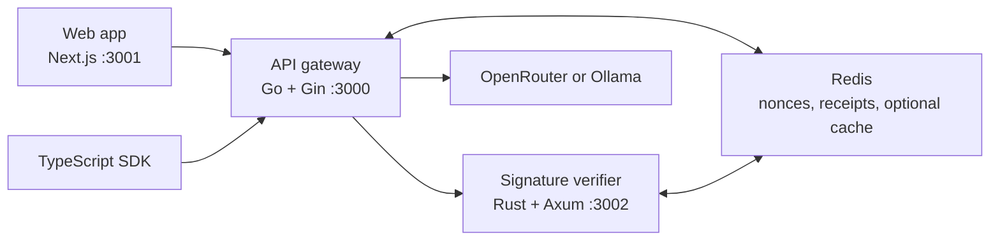

<div align="center">
  <h1>MicroAI Paygate</h1>

  

  <p><strong>Payment authorization, replay protection, and signed receipts for AI APIs.</strong></p>

  <p>
    <a href="https://github.com/AnkanMisra/MicroAI-Paygate/actions/workflows/go-tests.yml"></a>
    <a href="https://github.com/AnkanMisra/MicroAI-Paygate/actions/workflows/rust-tests.yml"></a>
    <a href="https://github.com/AnkanMisra/MicroAI-Paygate/actions/workflows/web-lint-build.yml"></a>
    <a href="https://github.com/AnkanMisra/MicroAI-Paygate/actions/workflows/sdk-tests.yml"></a>
    <a href="https://github.com/AnkanMisra/MicroAI-Paygate/actions/workflows/e2e.yml"></a>
    <a href="https://github.com/AnkanMisra/MicroAI-Paygate/actions/workflows/codeql-analysis.yml"></a>
  </p>

  <p>
    <a href="#overview">Overview</a> ·
    <a href="#how-it-works">How it works</a> ·
    <a href="#quick-start">Quick start</a> ·
    <a href="#api-and-sdk">API and SDK</a> ·
    <a href="#development">Development</a> ·
    <a href="https://microai-paygate.vercel.app">Live demo</a>
  </p>
</div>

## Overview

MicroAI Paygate is an open-source reference stack for payment-gated AI requests. It combines a Go API gateway, a Rust EIP-712 verifier, a Next.js wallet experience, configurable memory or Redis state, and a local TypeScript SDK.

An unsigned request receives HTTP `402 Payment Required`. The client signs the returned payment context, retries with `X-402-*` headers, and receives an AI result plus a gateway-signed receipt.

> [!IMPORTANT]
> This project is **x402-style**, not an official x402 implementation. A valid signature proves wallet authorization for a payment context; it does not prove that USDC moved on-chain or that facilitator settlement occurred.

### Live demo

Try the Base Sepolia demo at **[microai-paygate.vercel.app](https://microai-paygate.vercel.app)**.

> [!NOTE]
> The gateway and verifier run on Render's free tier and can sleep after inactivity. The first request may take 30–50 seconds while both services wake.

### Highlights

- **Explicit authorization** — wallets sign EIP-712 payment contexts before the AI provider is called.
- **Replay protection** — the verifier supports process-local memory or shared Redis nonce claims.
- **Signed receipts** — the gateway signs request and response hashes and supports receipt lookup by ID.
- **Operational controls** — timeouts, CORS, rate limits, optional response caching, health checks, and Prometheus metrics are built in.
- **Two client paths** — use the browser wallet flow or the repo-local TypeScript SDK.
- **Two AI providers** — OpenRouter is the default; Ollama is available for local experiments.

## How it works



Authorization v2 binds the payer and payment fields to the configured gateway audience, HTTP method, encoded path and raw query, content type, and SHA-256 hash of the exact request bytes. The verifier rejects malformed signatures, wrong chains, stale or future timestamps, replayed nonces, mismatched request bindings, and legacy authorization before the gateway calls the AI provider.

## Architecture



| Component | Responsibility |
| --- | --- |
| [`gateway/`](gateway/) | Public API, payment challenges, verifier orchestration, provider calls, receipts, cache, limits, and metrics. |
| [`verifier/`](verifier/) | EIP-712 recovery, chain and timestamp enforcement, and memory- or Redis-backed nonce replay protection. |
| [`web/`](web/) | Wallet detection, chain switching, signing, paid retry UX, receipt display, and browser documentation. |
| [`sdk/typescript/`](sdk/typescript/) | Programmatic challenge handling, typed-data signing, retries, receipt decoding, and trusted-key verification. |
| [`tests/`](tests/) | End-to-end unsigned challenge, signed retry, verifier acceptance, receipt, and replay checks. |

## Quick start

### Prerequisites

| Tool | Version |
| --- | --- |
| [Bun](https://bun.sh/) | `1.3.13+` |
| [Go](https://go.dev/) | `1.24.x` |
| [Rust](https://www.rust-lang.org/tools/install) | Stable |
| Docker and Redis | Optional; used for the Compose stack and shared persistence |

### Install

```bash
git clone https://github.com/AnkanMisra/MicroAI-Paygate.git
cd MicroAI-Paygate

bun install
(cd web && bun install)
(cd gateway && go mod download)
(cd verifier && cargo build -q)
cp .env.example .env
```

Set these development values in `.env`:

- `OPENROUTER_API_KEY` when using the default OpenRouter provider.
- `SERVER_WALLET_PRIVATE_KEY` to an **unfunded development key** used only for receipt signing.
- `RECIPIENT_ADDRESS` to the payment recipient shown in challenges.
- `CHAIN_ID` and `EXPECTED_CHAIN_ID` to the same chain; the default is Base Sepolia (`84532`).

Never use a funded wallet, seed phrase, production key, or real secret in local examples.

### Run without Redis

The example environment intentionally selects Redis-backed production-style stores. Override both stores for the lightweight local stack:

```bash
RECEIPT_STORE=memory \
VERIFIER_NONCE_STORE=memory \
CACHE_ENABLED=false \
bun run stack
```

Open:

- Web app: <http://localhost:3001>
- Gateway: <http://localhost:3000>
- Swagger UI: <http://localhost:3000/docs>
- Verifier health: <http://localhost:3002/health>

### Run with Docker Compose

The Compose stack starts all services with Redis-backed receipts and verifier nonce protection:

```bash
docker compose up --build
```

## API and SDK

### Gateway endpoints

| Endpoint | Purpose |
| --- | --- |
| `POST /api/ai/summarize` | Return a payment challenge or process a signed summarize request. |
| `GET /api/receipts/{id}` | Fetch a stored signed receipt before its TTL expires. |
| `GET /healthz` | Gateway liveness. |
| `GET /readyz` | Verifier, provider, Redis-when-required, and gateway readiness. |
| `GET /metrics` | Prometheus metrics when `METRICS_ENABLED` is enabled; configurable with `METRICS_PATH`. |
| `GET /openapi.yaml` | Raw OpenAPI contract. |
| `GET /docs` | Swagger UI. |

Signed retries include:

```http
X-402-Signature: <wallet signature>
X-402-Nonce: <nonce from paymentContext>
X-402-Timestamp: <timestamp from paymentContext>
X-402-Payer: <wallet address covered by the signature>
```

Successful responses return the signed receipt as base64-encoded JSON in `X-402-Receipt`. See [`gateway/openapi.yaml`](gateway/openapi.yaml) for the complete contract.

### TypeScript SDK

The private repo-local package `@microai/paygate-sdk` automates the unsigned request, challenge signing, paid retry, receipt decoding, and trusted-key verification flow.

```bash
cd sdk/typescript
bun install
bun run typecheck
bun run test
```

Install the unpublished package in another local app before importing it:

```bash
cd /path/to/your-app
bun add /path/to/MicroAI-Paygate/sdk/typescript
```

```ts
import { ethers } from "ethers";
import { PaygateClient } from "@microai/paygate-sdk";

const client = new PaygateClient({
  gatewayUrl: "http://localhost:3000",
  signer: new ethers.Wallet(process.env.EVM_PRIVATE_KEY!),
  trustedServerPublicKey: process.env.PAYGATE_SERVER_PUBLIC_KEY,
});

const response = await client.summarize("Text to summarize");
console.log(response.data.result, response.receiptVerified);
```

Read the [SDK guide](sdk/typescript/README.md) for local installation, error codes, receipt trust, and live testing.

## Configuration

The full local template is [`.env.example`](.env.example); production placeholders are in [`.env.production.example`](.env.production.example).

| Variable | Purpose |
| --- | --- |
| `AI_PROVIDER` | `openrouter` by default or `ollama` for a local provider. |
| `OPENROUTER_API_KEY`, `OPENROUTER_MODEL` | OpenRouter credentials and model selection. |
| `SERVER_WALLET_PRIVATE_KEY` | Signs gateway receipts; keep it secret and unfunded in demos. |
| `RECIPIENT_ADDRESS`, `PAYMENT_AMOUNT` | Values embedded in payment contexts. |
| `CHAIN_ID`, `EXPECTED_CHAIN_ID` | Gateway and verifier chain IDs; these must match. |
| `VERIFIER_URL` | Verifier base URL used by the gateway; required at startup. |
| `PAYGATE_AUDIENCE` | Required trusted public gateway origin used by request-bound authorization. Never derived from forwarded host headers. |
| `MIN_AUTHORIZATION_VERSION` | Verifier minimum accepted authorization version; defaults to `2`. Set `1` only for an explicit rollback window. |
| `VERIFIER_NONCE_STORE` | `memory` locally or `redis` for shared replay protection. |
| `RECEIPT_STORE` | `memory` locally or `redis` for restart-safe receipts. |
| `REDIS_URL` | Required by Redis nonce, receipt, or response-cache modes. |
| `CACHE_ENABLED` | Enables the optional Redis response cache; signed cache hits are still verified. |
| `NEXT_PUBLIC_GATEWAY_URL` | Browser-visible gateway URL compiled into the web app. |

Service-specific options are documented in the [gateway](gateway/README.md), [verifier](verifier/README.md), and [web](web/README.md) guides.

## Development

Run the checks for every component you change:

| Area | Commands |
| --- | --- |
| Gateway | `cd gateway && go test -v ./... && go vet ./...` |
| Verifier | `cd verifier && cargo fmt -- --check && cargo clippy -- -D warnings && cargo test` |
| Web | `cd web && bun run lint && bun run typecheck && bun run test:unit && bun run build` |
| SDK | `cd sdk/typescript && bun run typecheck && bun run test` |
| Unit suite | `bun run test:unit` |
| E2E | `RECEIPT_STORE=memory VERIFIER_NONCE_STORE=memory CACHE_ENABLED=false bun run test:e2e` — also requires `OPENROUTER_API_KEY` for the default provider |

> [!TIP]
> Do not replace `bun run test:e2e` with plain `bun test`; the E2E script builds and starts the gateway and verifier first.

## Deployment

The demo deployment uses Render for the gateway and verifier, Vercel for the web app, and Upstash Redis for shared nonces and signed receipts. Follow [DEPLOY.md](DEPLOY.md) for the platform-specific setup and secret checklist.

## Project guides

| Topic | Guide |
| --- | --- |
| Web documentation | Run `cd web && bun run dev`, then open [`/docs`](http://localhost:3001/docs). |
| Public API | [`gateway/openapi.yaml`](gateway/openapi.yaml) |
| Contributor workflow | [`CONTRIBUTING.md`](CONTRIBUTING.md) |
| Security reporting | [`SECURITY.md`](SECURITY.md) |
| Support | [`SUPPORT.md`](SUPPORT.md) |
| Repository rules | [`RULES.md`](RULES.md) |
| Benchmarks | [`bench/README.md`](bench/README.md) |

## Current boundaries

- The protocol uses custom `X-402-*` headers and has no official facilitator adapters.
- Wallet signatures authorize payment contexts but do not prove on-chain settlement.
- Gateway rate limits are process-local; horizontally scaled deployments need distributed limits.
- Memory-backed nonces and receipts are single-process development modes; use Redis for shared or restart-safe state.
- The default demo chain is Base Sepolia; changing chains requires aligned gateway, verifier, web, SDK, test, and documentation configuration.

If this project helps you, consider starring the repository so more contributors can find it.
